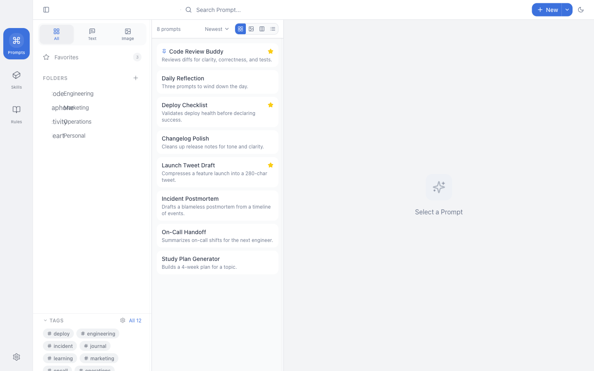

<div align="center">
  
  <h1>PromptHub</h1>
  <p><strong>🚀 オープンソース、ローカルファーストの AI プロンプト＆スキルマネージャー</strong></p>
  <p>プロンプト管理 · スキルストア · マルチプラットフォームインストール · バージョン管理 · マルチモデルテスト — オールインワン AI ワークスペース</p>
  
  <p>
    <a href="https://github.com/legeling/PromptHub/stargazers"></a>
    <a href="https://github.com/legeling/PromptHub/network/members"></a>
    <a href="https://github.com/legeling/PromptHub/releases"></a>
    <a href="https://github.com/legeling/PromptHub/releases"></a>
    
  </p>
  
  <p>
    
    
    
    
  </p>
  
  <p>
    <a href="../README.md">简体中文</a> ·
    <a href="./README.zh-TW.md">繁體中文</a> ·
    <a href="./README.en.md">English</a> ·
    <a href="./README.ja.md">日本語</a> ·
    <a href="./README.de.md">Deutsch</a> ·
    <a href="./README.es.md">Español</a> ·
    <a href="./README.fr.md">Français</a>
  </p>
</div>

<br/>

> 💡 **なぜ PromptHub なのか？**
>
> PromptHub はプロンプト管理ツールだけでなく、**AI スキル配信センター**です。プロンプトと SKILL.md スキルを管理し、Claude Code、Cursor、Windsurf、Codex など 12 以上の AI コーディングツールにワンクリックでインストール。すべてのデータはローカルに保存され、プライバシーも万全です。

---

## 📥 ダウンロード

<div align="center">
  <a href="https://github.com/legeling/PromptHub/releases">
    
  </a>
</div>

| プラットフォーム |                                                                                                                                                                                                              ダウンロード                                                                                                                                                                                                               |
| :--------------: | :-------------------------------------------------------------------------------------------------------------------------------------------------------------------------------------------------------------------------------------------------------------------------------------------------------------------------------------------------------------------------------------------------------------------------------------: |
|     Windows      | [](https://github.com/legeling/PromptHub/releases/latest/download/PromptHub-Setup-0.4.5-x64.exe) [](https://github.com/legeling/PromptHub/releases/latest/download/PromptHub-Setup-0.4.5-arm64.exe) |
|      macOS       |   [](https://github.com/legeling/PromptHub/releases/latest/download/PromptHub-0.4.5-arm64.dmg) [](https://github.com/legeling/PromptHub/releases/latest/download/PromptHub-0.4.5-x64.dmg)   |
|      Linux       |       [](https://github.com/legeling/PromptHub/releases/latest/download/PromptHub-0.4.5-x64.AppImage) [](https://github.com/legeling/PromptHub/releases/latest/download/prompthub_0.4.5_amd64.deb)        |

---

## ✨ 機能紹介

### 📝 プロンプト管理

- 作成、編集、削除。フォルダとタグによる整理
- 履歴を自動保存。過去バージョンの閲覧、比較、復元
- テンプレート変数 `{{variable}}` による動的な置換
- 全文検索、お気に入り、マルチメディア添付

### 🧩 Skill スキル管理 🆕

- **スキルストア**：20以上の厳選スキル（Anthropic、OpenAI など）
- **マルチプラットフォームインストール**：Claude Code、Cursor、Windsurf、Codex、Kiro、Gemini CLI など 12 以上のプラットフォームにワンクリックインストール
- **ローカルスキャン**：ローカルの SKILL.md を自動検出、プレビュー後に選択インポート
- **シンボリックリンク/コピーモード**：Sylink 同期編集または独立コピー
- **AI 翻訳**：没入型/全文翻訳に対応
- **タグフィルタリング**：タグでスキルを素早くフィルタリング

### 🤖 AI 機能

- 国内外の主要なプロバイダーによるマルチモデルテスト
- 複数モデルの並列比較テスト
- AI スキルコンテンツ生成とブラッシュアップ

### 💾 データと同期

- すべてのデータはローカルに保存、プライバシー保護
- フルバックアップ/復元（`.phub.gz`）
- WebDAV クラウド同期
- ダーク/ライト/システム、７言語、クロスプラットフォーム

## 📸 スクリーンショット

<div align="center">
  <p><strong>メイン画面</strong></p>
  
  <br/><br/>
  <p><strong>ギャラリービュー</strong></p>
  
  <br/><br/>
  <p><strong>リストビュー</strong></p>
  
  <br/><br/>
  <p><strong>データバックアップ</strong></p>
  
  <br/><br/>
  <p><strong>テーマ設定</strong></p>
  
  <br/><br/>
  <p><strong>二ヶ国語対照</strong></p>
  
  <br/><br/>
  <p><strong>変数の入力</strong></p>
  
  <br/><br/>
  <p><strong>バージョン比較</strong></p>
  
  <br/><br/>
  <p><strong>多言語サポート</strong></p>
  
</div>

## 📦 インストール方法

### ダウンロード

[Releases](https://github.com/legeling/PromptHub/releases) からお使いのプラットフォーム用のインストーラーをダウンロードしてください：

| プラットフォーム |                                                                                                                                                                                                              ダウンロード                                                                                                                                                                                                               |
| :--------------: | :-------------------------------------------------------------------------------------------------------------------------------------------------------------------------------------------------------------------------------------------------------------------------------------------------------------------------------------------------------------------------------------------------------------------------------------: |
|     Windows      | [](https://github.com/legeling/PromptHub/releases/latest/download/PromptHub-Setup-0.4.5-x64.exe) [](https://github.com/legeling/PromptHub/releases/latest/download/PromptHub-Setup-0.4.5-arm64.exe) |
|      macOS       |   [](https://github.com/legeling/PromptHub/releases/latest/download/PromptHub-0.4.5-arm64.dmg) [](https://github.com/legeling/PromptHub/releases/latest/download/PromptHub-0.4.5-x64.dmg)   |
|      Linux       |       [](https://github.com/legeling/PromptHub/releases/latest/download/PromptHub-0.4.5-x64.AppImage) [](https://github.com/legeling/PromptHub/releases/latest/download/prompthub_0.4.5_amd64.deb)        |

### macOS で Homebrew を使ってインストール

```bash
brew tap legeling/tap
brew install --cask prompthub
```

### macOS での初回起動について

本アプリは Apple の公証を受けていないため、初回起動時に「**PromptHubは壊れているため開けません**」や「**開発元を検証できないため開けません**」と表示される場合があります。

**解決方法（推奨）**: ターミナルを開き、以下のコマンドを実行して公証チェックを回避してください：

```bash
sudo xattr -rd com.apple.quarantine /Applications/PromptHub.app
```

> 💡 **ヒント**: アプリを別の場所にインストールした場合は、実際のパスに置き換えてください。

**または**: 「システム設定」→「プライバシーとセキュリティ」→ セキュリティセクションまでスクロールし、「このまま開く」をクリックしてください。

<div align="center">
  
</div>

### ソースからのビルド

```bash
# リポジトリをクローン
git clone https://github.com/legeling/PromptHub.git
cd PromptHub

# 依存関係のインストール
pnpm install

# 開発モード
pnpm dev

# アプリのビルド
pnpm build
```

## 🚀 クイックスタート

### 1. プロンプトの作成

「新規作成」ボタンをクリックし、以下を入力します：

- **タイトル** - プロンプトの名前
- **説明** - 用途の簡単な説明
- **System Prompt** - AI の役割設定（任意）
- **User Prompt** - 実際のプロンプト内容
- **タグ** - 分類と検索用

### 2. 変数の使用

プロンプト内で `{{変数名}}` 構文を使用して変数を定義できます：

```
以下の {{source_lang}} のテキストを {{target_lang}} に翻訳してください：

{{text}}
```

### 3. コピーして使用

プロンプトを選択して「コピー」をクリックすると、内容がクリップボードにコピーされます。

### 4. バージョン管理

編集履歴は自動的に保存されます。「履歴」をクリックして過去バージョンの閲覧や復元が可能です。

## 🛠️ 技術スタック

| カテゴリ       | 使用技術                |
| -------------- | ----------------------- |
| フレームワーク | Electron 33             |
| フロントエンド | React 18 + TypeScript 5 |
| スタイリング   | TailwindCSS             |
| 状態管理       | Zustand                 |
| ローカル保存   | SQLite                  |
| ビルドツール   | Vite + electron-builder |

## 📁 プロジェクト構造

```
PromptHub/
├── src/
│   ├── main/           # Electron メインプロセス
│   ├── preload/        # プリロードスクリプト
│   ├── renderer/       # React レンダラープロセス
│   │   ├── components/ # UI コンポーネント
│   │   ├── stores/     # Zustand 状態管理
│   │   ├── services/   # データベースサービス
│   │   └── styles/     # グローバルスタイル
│   └── shared/         # 共通の型定義
├── resources/          # 静的アセット
└── package.json
```

## 📈 Star History

<a href="https://star-history.com/#legeling/PromptHub&Date">
  <picture>
    <source media="(prefers-color-scheme: dark)" srcset="https://api.star-history.com/svg?repos=legeling/PromptHub&type=Date&theme=dark" />
    <source media="(prefers-color-scheme: light)" srcset="https://api.star-history.com/svg?repos=legeling/PromptHub&type=Date" />
    
  </picture>
</a>

## 🗺️ ロードマップ

### v0.4.5（現在）🎉

- [x] **Prompt コピー言語修正**：画像/ギャラリービューのコピーが表示中の言語に追従し、英語 UI で中国語がコピーされる問題を修正 (closes #67)
- [x] **Skill 白画面修正**：旧 Skill の不正なメタデータを正規化し、詳細画面の白画面を防止 (closes #66)
- [x] **配布状態の即時同期**：単体配布・一括配布・アンインストール後にサイドバー状態を即時更新
- [x] **PromptHub 管理ディレクトリの自動検出**：既定のローカルスキャンが `userData/skills` を含むように改善
- [x] **スナップショット UI 改善**：スナップショット作成を不安定なネイティブ `window.prompt()` からアプリ内モーダルに変更
- [x] **インポートと一括操作の改善**：検索付きインポートプレビュー、任意タグ、一括配布/タグ操作を整理

### v0.3.x

- [x] 多階層フォルダ、バージョン管理、変数テンプレート
- [x] マルチモデルラボ、WebDAV 同期、Markdown レンダリング
- [x] マルチビューモード、システム統合、セキュリティとプライバシー

### 今後の計画

- [ ] **ブラウザ拡張**：ChatGPT/Claude のウェブから PromptHub にアクセス
- [ ] **モバイルアプリ**：スマホで閲覧、検索、編集
- [ ] **プラグインシステム**：カスタム AI プロバイダーやローカルモデルの統合
- [ ] **スキルマーケットプレイス**：コミュニティ作成スキルのアップロードと共有

## 📝 更新履歴

すべての更新履歴はこちら：**[CHANGELOG.md](../CHANGELOG.md)**

### 最新バージョン v0.4.5 (2026-03-14) 🎉

**修正**

- 🌐 **Prompt コピー言語修正**：画像/ギャラリービューのコピーが表示中の言語に追従するように修正 (closes #67)
- 🧩 **Skill 白画面修正**：旧 Skill の不正メタデータによる詳細画面の白画面を防止 (closes #66)
- 🔄 **配布状態更新修正**：配布・アンインストール後にサイドバーとフィルタ状態を即時更新
- 📸 **スナップショット操作修正**：ネイティブ prompt を廃止し、アプリ内モーダルに置き換え

**改善**

- 🚀 **Skill 一括操作改善**：一括配布と一括タグ付けの導線を整理
- 🔍 **インポート体験改善**：ローカルインポートプレビューに検索を追加し、タグ入力を任意化
- 🕓 **Skill バージョン管理強化**：履歴プレビュー、Diff 比較、復元と自動スナップショットを追加

> 📋 [更新履歴の詳細はこちら](../CHANGELOG.md)

## 🤝 貢献について

貢献を歓迎します！以下の手順に従ってください：

1. リポジトリをフォークする
2. 機能用のブランチを作成する (`git checkout -b feature/amazing-feature`)
3. 変更をコミットする (`git commit -m 'Add amazing feature'`)
4. ブランチにプッシュする (`git push origin feature/amazing-feature`)
5. プルリクエストを作成する

## 📄 ライセンス

本プロジェクトは [AGPL-3.0 License](../LICENSE) の下で公開されています。

## 💬 サポート

- **不具合報告**: [GitHub Issues](https://github.com/legeling/PromptHub/issues)
- **機能提案**: [GitHub Discussions](https://github.com/legeling/PromptHub/discussions)

## 🙏 謝辞

- [Electron](https://www.electronjs.org/)
- [React](https://react.dev/)
- [TailwindCSS](https://tailwindcss.com/)
- [Zustand](https://zustand-demo.pmnd.rs/)
- [Lucide](https://lucide.dev/)
- PromptHub の改善に協力してくれたすべての素晴らしい [貢献者](https://github.com/legeling/PromptHub/graphs/contributors) の皆様に感謝します！

---

<div align="center">
  <p><strong>このプロジェクトが役に立った場合は、⭐ を付けて応援してください！</strong></p>
  
  <a href="https://www.buymeacoffee.com/legeling" target="_blank">
    
  </a>
</div>

---

## 💖 支援者への謝辞 / Backers

PromptHub への寄付を通じて開発を支援してくださった方々に深く感謝いたします：

| 日付       | 支援者 | 金額     | メッセージ                                           |
| :--------- | :----- | :------- | :--------------------------------------------------- |
| 2026-01-08 | \*🌊   | ￥100.00 | 素晴らしいソフトウェアを応援しています！             |
| 2025-12-29 | \*昊   | ￥20.00  | あなたのソフトウェアに感謝！微力ながら応援しています |

---

## ☕ 開発を支援する

PromptHub がお役に立てたなら、作者にコーヒーを一杯おごってください ☕

<div align="center">
  <table>
    <tr>
      <td align="center">
        
        <br/>
        <b>WeChat Pay</b>
      </td>
      <td align="center">
        
        <br/>
        <b>Alipay</b>
      </td>
    </tr>
  </table>
</div>

📧 **連絡先**: legeling567@gmail.com

すべての支援者の皆様に感謝します！皆様のサポートが開発の大きな励みになります！

<div align="center">
  <p>Made with ❤️ by <a href="https://github.com/legeling">legeling</a></p>
</div>
