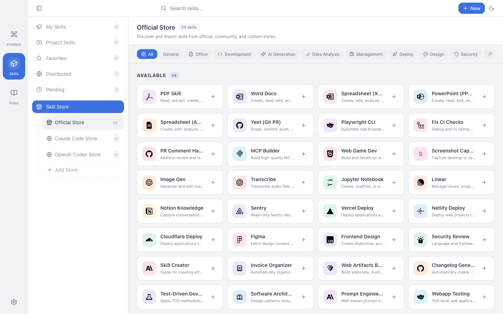

<div align="center">
  
  <h1>PromptHub</h1>
  <p><strong>🚀 一款涵蓋 Prompt 管理、Skill 管理與 Agent 資產管理的一站式 AI 工具箱</strong></p>
  <p>高效管理提示詞 · 一鍵分發 Skills · 一站式管理 Agent 資產 · 雲端同步 · 備份還原 · 版本管理</p>

  <p>
    <a href="https://github.com/legeling/PromptHub/stargazers"></a>
    <a href="https://github.com/legeling/PromptHub/network/members"></a>
    <a href="https://github.com/legeling/PromptHub/releases"></a>
    <a href="https://github.com/legeling/PromptHub/releases"></a>
    
  </p>

  <p>
    
    
    
    
  </p>

  <p>
    <a href="../README.md">简体中文</a> ·
    <a href="./README.zh-TW.md">繁體中文</a> ·
    <a href="./README.en.md">English</a> ·
    <a href="./README.ja.md">日本語</a> ·
    <a href="./README.de.md">Deutsch</a> ·
    <a href="./README.es.md">Español</a> ·
    <a href="./README.fr.md">Français</a>
  </p>
</div>

<br/>

<div align="center">
  <a href="https://github.com/legeling/PromptHub/releases">
    
  </a>
</div>

<br/>

> 💡 **為什麼選擇 PromptHub？**
>
> PromptHub 不只是 Prompt 管理器，更是圍繞 Prompt、SKILL.md 與 Agent 資產的本機優先工作台。你可以集中整理提示詞、掃描並分發 Skills 到 Claude Code、Cursor、Windsurf、Codex 等 15+ AI 工具，並透過雲端同步、備份還原與版本管理維護個人或專案級 AI 資產。

---

## 你可以怎麼使用 PromptHub

| 形態 | 適合誰 | 核心價值 |
| ---- | ------ | -------- |
| 桌面版 | 大多數個人使用者、提示詞重度使用者、AI 編程工作流使用者 | 本機優先的主工作區，集中管理 Prompt、Skill 與專案級 AI 資產 |
| 自部署網頁版 | 需要瀏覽器存取、個人自託管、想把 Web 當成備份源 / 還原源的使用者 | 輕量瀏覽器工作區，可作為桌面版同步目標 |
| CLI | 有批次處理、腳本、自動化與流程整合需求的使用者 | 直接操作本地 PromptHub 資料與受管 Skill 倉庫 |

如果你第一次接觸 PromptHub，建議順序是：

1. 先安裝桌面版，把 Prompt 和 Skills 管起來。
2. 有跨裝置或瀏覽器存取需求時，再接入 WebDAV 或自部署 Web。
3. 有自動化需求時，再加入 CLI。

## 📸 截圖

<div align="center">
  <p><strong>主界面</strong></p>
  
  <br/><br/>
  <p><strong>Skill 商店</strong></p>
  
  <br/><br/>
  <p><strong>Skill 詳情與平台安裝</strong></p>
  
  <br/><br/>
  <p><strong>Skill 檔案編輯與版本對比</strong></p>
  
  <br/><br/>
  <p><strong>資料備份</strong></p>
  
  <br/><br/>
  <p><strong>主題與背景設定</strong></p>
  
  <br/><br/>
  <p><strong>版本對比</strong></p>
  
</div>

## ✨ 功能特性

### 📝 Prompt 管理

- 建立、編輯、刪除，支援資料夾和標籤分類
- 自動保存歷史版本，支援查看、對比和回退
- 模板變數 `{{variable}}` 可在複製、測試或分發時動態填入
- 收藏、全文搜尋、附件與多媒體預覽

### 🧩 Skill 分發與管理

- **技能商店**：內建 20+ 精選技能（來自 Anthropic、OpenAI 等）
- **多平台安裝**：一鍵安裝到 Claude Code、Cursor、Windsurf、Codex、Kiro、Gemini CLI、Qoder、QoderWork、CodeBuddy 等 15+ 平台
- **本地掃描**：自動發現本地 `SKILL.md`，預覽後選擇性導入
- **軟連結 / 複製模式**：支援 Symlink 同步編輯或獨立複製
- **平台目標目錄**：可為每個平台覆寫 Skills 目錄，讓掃描與分發保持一致
- **AI 翻譯與潤飾**：在 PromptHub 內直接翻譯或優化完整 Skill 內容
- **標籤篩選**：依標籤快速過濾技能

### 🤖 專案與 Agent 資產

- 掃描專案中的 `.claude/skills`、`.agents/skills`、`skills`、`.gemini` 等常見目錄
- 在同一個工作區管理個人庫、本地倉庫與專案級 AI 資產
- 透過本機優先存儲、同步與備份，維護 Prompt、Skill 與專案級資產

### 🧪 AI 測試與生成

- 內建 AI 測試，支援各類主流服務商
- 同一 Prompt 多模型並行比較
- 支援圖像生成模型測試
- AI 技能內容生成與潤飾

### 💾 資料與同步

- 所有資料存儲在本地，隱私優先
- 全量備份與恢復（`.phub.gz`）
- WebDAV 雲同步
- 支援自部署 PromptHub Web 作為桌面版備份源 / 還原源
- 支援啟動同步與排程同步

### 🎨 介面與安全

- 卡片、畫廊、列表三種視圖
- 深色 / 淺色 / 跟隨系統，多種主題色
- 自訂背景圖片
- 7 種語言、Markdown 渲染、程式碼高亮與跨平台支援
- 主密碼保護
- 私密資料夾（Beta）

## 📥 桌面版下載與安裝

如果你要開始使用 PromptHub，建議先從桌面版開始。

### 下載

從 [Releases](https://github.com/legeling/PromptHub/releases) 下載最新版本 `v0.5.5`：

| 平台 | 下載 |
| :--: | :--- |
| Windows | [](https://github.com/legeling/PromptHub/releases/latest/download/PromptHub-Setup-0.5.5-x64.exe) [](https://github.com/legeling/PromptHub/releases/latest/download/PromptHub-Setup-0.5.5-arm64.exe) |
| macOS | [](https://github.com/legeling/PromptHub/releases/latest/download/PromptHub-0.5.5-arm64.dmg) [](https://github.com/legeling/PromptHub/releases/latest/download/PromptHub-0.5.5-x64.dmg) |
| Linux | [](https://github.com/legeling/PromptHub/releases/latest/download/PromptHub-0.5.5-x64.AppImage) [](https://github.com/legeling/PromptHub/releases/latest/download/prompthub_0.5.5_amd64.deb) |
| 預覽通道 | [](https://github.com/legeling/PromptHub/releases?q=prerelease%3Atrue) |

> 💡 **安裝建議**
>
> - **macOS**：Apple Silicon（M1/M2/M3/M4）下載 `arm64`，Intel Mac 下載 `x64`
> - **Windows**：大多數裝置下載 `x64`；只有 Windows on ARM 裝置才需要 `arm64`
> - **預覽通道**：預覽構建發布在 GitHub `Prereleases`；設定中啟用預覽版通道後只會檢查 prerelease 構建
> - **回到穩定版**：如需恢復 stable 更新檢查，請先關閉預覽版通道；PromptHub 不會自動從較新的預覽版降級到較舊的穩定版

### macOS 透過 Homebrew 安裝

```bash
brew tap legeling/tap
brew install --cask prompthub
```

### Homebrew 使用者升級方式

如果你是透過 Homebrew 安裝，後續升級應優先使用 Homebrew，不要和應用內 DMG 更新流程混用：

```bash
brew update
brew upgrade --cask prompthub
```

如果本地 Homebrew 狀態異常，可以重新安裝目前版本：

```bash
brew reinstall --cask prompthub
```

> - 透過 DMG/EXE 手動安裝的使用者：優先使用應用內更新或從 GitHub Releases 下載
> - 透過 Homebrew 安裝的使用者：優先使用 `brew upgrade --cask prompthub`，不要再切回應用內 DMG 更新路徑
> - 混用兩種升級方式可能讓 Homebrew 記錄版本與實際安裝狀態不同步

### macOS 首次啟動

由於應用未經 Apple 公證簽名，首次打開時可能會看到 **"PromptHub 已損壞，無法打開"** 或 **"無法驗證開發者"**。

**解決方法（推薦）**：打開終端並執行以下命令以繞過 Gatekeeper：

```bash
sudo xattr -rd com.apple.quarantine /Applications/PromptHub.app
```

> 💡 **提示**：如果應用安裝在其他位置，請改成實際安裝路徑。

**或者**：打開「系統設定」→「隱私與安全性」→ 向下捲動到安全性區塊 → 點擊「仍要打開」。

<div align="center">
  
</div>

### 從原始碼執行桌面版

```bash
git clone https://github.com/legeling/PromptHub.git
cd PromptHub
pnpm install

# 啟動桌面開發環境
pnpm electron:dev

# 構建桌面版
pnpm build

# 如需構建自部署 Web
pnpm build:web
```

> 倉庫根的 `pnpm build` 預設只構建桌面版；如需 Web 產物，請明確執行 `pnpm build:web`。

## 🚀 快速開始

### 1. 建立你的第一個 Prompt

點擊「新建」按鈕，填入標題、描述、`System Prompt`、`User Prompt` 與標籤。

### 2. 使用模板變數

在 Prompt 中使用 `{{變數名}}` 語法：

```text
請將以下 {{source_lang}} 文本翻譯成 {{target_lang}}：

{{text}}
```

### 3. 把 Skills 納入工作區

- 從技能商店加入常用 Skills
- 掃描本地或專案中的 `SKILL.md`
- 導入後在「我的 Skills」中繼續編輯、翻譯、對比版本與分發

### 4. 一鍵分發到 AI 工具

- 選擇 Claude Code、Cursor、Windsurf、Codex、Gemini CLI 等目標平台
- PromptHub 會協助把 Skill 安裝到各平台目錄

> 🖥️ **目前支援的平台**：Claude Code、GitHub Copilot、Cursor、Windsurf、Kiro、Gemini CLI、Trae、OpenCode、Codex CLI、Roo Code、Amp、OpenClaw、Qoder、QoderWork、CodeBuddy

### 5. 設定同步與備份

- 可選配置 WebDAV 進行多裝置同步
- 或在 `設定 -> 資料` 中接入自部署 PromptHub Web 作為備份源 / 還原源

## 命令列 CLI

PromptHub 同時提供 GUI 與 CLI。CLI 適合腳本化管理、批次作業、匯入、掃描與自動化流程。

### 桌面版使用者直接使用

> ⚠️ **目前行為**
>
> - 安裝桌面版並首次啟動一次 PromptHub 後，應用會自動安裝 `prompthub` 命令
> - 重新開啟終端後，就可以直接使用 `prompthub --參數`
> - 原始碼執行與構建後的 CLI bundle 仍保留，適合開發與除錯

```bash
prompthub --help
prompthub prompt list
prompthub skill list
prompthub skill scan
prompthub --output table prompt search SEO --favorite
```

> 💡 **提示**
>
> - 如果你剛安裝完桌面版，請先啟動一次 PromptHub
> - 如果目前終端還找不到 `prompthub`，請關閉並重新打開終端

### 從原始碼執行

```bash
pnpm --filter @prompthub/desktop cli:dev -- --help
pnpm --filter @prompthub/desktop cli:dev -- prompt list
pnpm --filter @prompthub/desktop cli:dev -- skill list
pnpm --filter @prompthub/desktop cli:dev -- skill scan
pnpm --filter @prompthub/desktop cli:dev -- skill install ~/.claude/skills/my-skill
```

### 使用構建後的 CLI bundle

```bash
pnpm build
node apps/desktop/out/cli/prompthub.cjs --help
node apps/desktop/out/cli/prompthub.cjs prompt list
node apps/desktop/out/cli/prompthub.cjs skill list
```

### 常用參數

- `--output json|table`
- `--data-dir /path/to/user-data`
- `--app-data-dir /path/to/app-data`

### 支援的命令

- `prompt list|get|create|update|delete|search`
- `skill list|get|install|scan|delete|remove`

### 說明

- CLI 會直接讀寫 PromptHub 的本地資料庫與受管 Skill 倉庫
- 桌面版會在首次啟動時自動安裝 shell 命令包裝器
- 如果你之後移動了應用位置，再次啟動 PromptHub 會自動刷新命令包裝器路徑

## 🌐 自部署網頁版

PromptHub Web 是輕量自部署瀏覽器工作區，不是官方 SaaS 雲端服務。它適合：

- 想在瀏覽器中存取自己的 PromptHub 資料
- 想把自部署 Web 當成桌面版的備份源 / 還原源
- 不想只依賴 WebDAV，而想要更直接的單機自託管工作區

### Docker Compose 快速啟動

在倉庫根目錄執行：

```bash
cd apps/web
cp .env.example .env
docker compose up -d --build
```

至少需要關注這幾個配置：

- `JWT_SECRET`：至少 32 位隨機字串，用於登入鑑權
- `ALLOW_REGISTRATION=false`：初始化後建議保持關閉，避免公開註冊
- `DATA_ROOT`：PromptHub Web 的資料根目錄，會寫入 `data/`、`config/`、`logs/`、`backups/`

預設存取網址：`http://localhost:3871`

### 首次初始化

- 新實例首次訪問時會進入 `/setup`，而不是登入頁
- 第一個使用者會成為管理員
- 首個管理員建立完成後，公開註冊預設關閉

### 桌面版接入 PromptHub Web

桌面版進入 `設定 -> 資料` 後，可以配置：

- 自部署 PromptHub URL
- 使用者名稱
- 密碼

配置完成後，桌面版可以：

- 測試連線
- 上傳目前本地工作區到 PromptHub Web
- 從 PromptHub Web 下載並還原
- 啟動時自動拉取
- 依排程背景推送

### 資料與備份

請備份整個資料根目錄，而不只是 SQLite 檔案。典型持久化路徑包括：

```bash
apps/web/data
apps/web/config
apps/web/logs
```

其中可能包含：

- `data/prompthub.db`
- `data/prompts/...`
- `data/skills/...`
- `data/assets/...`
- `config/settings/...`
- `backups/...`
- `logs/...`

更完整的部署、升級、備份、GHCR 映像與開發說明見 [`web-self-hosted.md`](./web-self-hosted.md)。

## 📈 Star History

<a href="https://star-history.com/#legeling/PromptHub&Date">
  <picture>
    <source media="(prefers-color-scheme: dark)" srcset="https://api.star-history.com/svg?repos=legeling/PromptHub&type=Date&theme=dark" />
    <source media="(prefers-color-scheme: light)" srcset="https://api.star-history.com/svg?repos=legeling/PromptHub&type=Date" />
    
  </picture>
</a>

## 🗺️ 路線圖

### v0.5.5（目前穩定版）🚀

- [x] **Skill 商店更新檢測**：商店下載的 Skill 會保存安裝時內容雜湊，可檢查遠端 `SKILL.md` 是否更新並安全套用更新
- [x] **完整 Skill 文檔翻譯**：AI 翻譯現在圍繞完整 `SKILL.md` 生成 sidecar 譯文，支援全文翻譯與沉浸式對照模式
- [x] **資料目錄切換真正生效**：切換資料目錄後會透過桌面 relaunch 重新套用 `userData` 路徑
- [x] **AI 測試與翻譯錯誤提示更清楚**：模型測試會直接顯示「XX 模型測試成功 / 失敗」，翻譯未配置、逾時與 `504` 也會明確提示
- [x] **Web 媒體與同步修復**：修復媒體上傳顯示、普通資料夾誤判私密與 Web 登入密碼修改入口

### v0.4.9

- [x] 安全加固、架構重構、Skill 元數據編輯修復
- [x] 資料庫遷移修復、代碼品質清理、720 測試全綠

### v0.4.8

- [x] AI 工作台實裝、skills.sh 社群商店接入、歷史版本刪除
- [x] 備份 / WebDAV 強化、資料目錄遷移顯示修復、大量 Skill 效能優化

### v0.3.x

- [x] 多層級資料夾、版本控制、變數範本
- [x] 多模型實驗室、WebDAV 同步、Markdown 渲染
- [x] 多視圖模式、系統整合、安全與隱私

### 未來規劃

- [ ] **瀏覽器擴充功能**：在網頁端（如 ChatGPT/Claude）直接調取 PromptHub 庫
- [ ] **行動端應用**：支援手機端查看、搜尋與編輯
- [ ] **外掛系統**：支援用戶自定義擴充 AI 供應商或本地模型
- [ ] **技能市場**：支援用戶上傳和分享自己創建的技能

## 📝 更新日誌

查看完整更新日誌：**[CHANGELOG.md](../CHANGELOG.md)**

### 最新版本 v0.5.5 (2026-05-05) 🎉

**Skill / AI**

- 🧩 **商店 Skill 更新檢測與衝突保護**：保存安裝時內容雜湊與版本，並比較最新遠端 `SKILL.md`；若本地與遠端同時變更則提示衝突
- 🌍 **完整 `SKILL.md` 翻譯 sidecar**：Skill 翻譯現在會為完整文檔保存 sidecar 譯文，支援全文翻譯與沉浸式雙語對照
- 💬 **AI 測試與翻譯錯誤提示優化**：模型測試直接顯示「XX 模型測試成功 / 失敗」，翻譯未配置、逾時或 `504` 也會給出明確提示

**桌面 / Desktop**

- 🗂️ **資料目錄切換真正重啟生效**：切換資料目錄後會透過專用 relaunch IPC 重新套用 `userData` 路徑，重新選擇目前目錄也不會誤報待重啟
- 🎞️ **影片儲存邊界收緊**：影片儲存只接受主進程檔案選擇器剛返回的目標路徑，並限制在支援的副檔名範圍內
- 🔄 **平台部署隱藏內部 sidecar**：Skill 平台 symlink 安裝改為只連結 canonical `SKILL.md`，不再把 `.prompthub` sidecar 暴露到外部平台技能目錄

**Web / Docs**

- 🌐 **媒體上傳與顯示修復**：Web/Docker 可上傳所選媒體，並顯示桌面同步的 `local-image://` / `local-video://` 連結
- 🔐 **同步私密狀態與密碼修復**：缺失 `visibility` 的桌面資料夾不再被 Web 誤判為私密，自架 Web 設定頁也新增登入密碼修改入口
- 🌍 **發版文件重同步**：README、多語言文件、CHANGELOG 與官網發布資料重新同步，讓最終 `v0.5.5` 說明與實際交付內容一致

> 📋 [更新日誌詳情](../CHANGELOG.md)

## 🤝 貢獻與開發

### 入口說明

- 根 `CONTRIBUTING.md`：GitHub 可發現的貢獻入口
- `docs/contributing.md`：目前有效的 canonical 貢獻指南
- `docs/README.md`：對外文件索引
- `spec/README.md`：內部 SSD / spec 索引

### 🛠️ 技術棧

| 類別 | 技術 |
| ---- | ---- |
| 桌面端 Runtime | Electron 33 |
| 桌面端前端 | React 18 + TypeScript 5 + Vite 6 |
| 自部署 Web | Hono + React + Vite |
| 樣式 | Tailwind CSS 3 |
| 狀態管理 | Zustand |
| 資料層 | SQLite、`better-sqlite3`、`node-sqlite3-wasm` |
| Monorepo 套件 | `packages/shared`、`packages/db` |

### 📁 倉庫結構

```text
PromptHub/
├── apps/
│   ├── desktop/   # Electron 桌面端 + CLI
│   └── web/       # 自部署 Web
├── packages/
│   ├── db/        # 共享資料層
│   └── shared/    # 共享型別、常量與協議
├── docs/          # 對外文件
├── spec/          # 內部 SSD / spec 系統
├── website/       # 官網相關資源
├── README.md
├── CONTRIBUTING.md
└── package.json
```

### 常用命令

| 場景 | 命令 |
| ---- | ---- |
| 桌面端開發 | `pnpm electron:dev` |
| Web 開發 | `pnpm dev:web` |
| 桌面端構建 | `pnpm build` |
| Web 構建 | `pnpm build:web` |
| 桌面端 lint | `pnpm lint` |
| Web lint | `pnpm lint:web` |
| 桌面端全量測試 | `pnpm test -- --run` |
| Web 全量驗證 | `pnpm verify:web` |
| CLI 原始碼執行 | `pnpm --filter @prompthub/desktop cli:dev -- --help` |
| E2E | `pnpm test:e2e` |
| 桌面端發版前門禁 | `pnpm test:release` |

### 文件與 SSD 工作流

- `docs/` 面向使用者、部署者與貢獻者
- `spec/` 面向內部 SSD、穩定領域文檔、邏輯、固定資產、架構與活躍變更
- 非 trivial 的改動應先建立 `spec/changes/active/<change-key>/`
- 每個重要變更至少包含 `proposal.md`、`specs/<domain>/spec.md`、`design.md`、`tasks.md`、`implementation.md`
- 穩定內部事實回寫到 `spec/`，對外契約變更同步到 `docs/` 或 `README.md`

完整貢獻規範、測試門檻與提交要求見 [`contributing.md`](./contributing.md)。

## 📄 許可證

本項目採用 [AGPL-3.0 License](../LICENSE) 開源協議。

## 💬 支持與反饋

- **問題反饋**: [GitHub Issues](https://github.com/legeling/PromptHub/issues)
- **功能建議**: [GitHub Discussions](https://github.com/legeling/PromptHub/discussions)

## 🙏 致謝

- [Electron](https://www.electronjs.org/)
- [React](https://react.dev/)
- [TailwindCSS](https://tailwindcss.com/)
- [Zustand](https://zustand-demo.pmnd.rs/)
- [Lucide](https://lucide.dev/)
- 感謝所有為 PromptHub 做出貢獻的 [開發者](https://github.com/legeling/PromptHub/graphs/contributors)！

---

<div align="center">
  <p><strong>如果這個項目對你有幫助，請給個 ⭐ 支持一下！</strong></p>

  <a href="https://www.buymeacoffee.com/legeling" target="_blank">
    
  </a>
</div>

---

## 💖 致謝支持者 / Backers

感謝以下朋友對 PromptHub 的捐助支持：

| 日期 | 支持者 | 金額 | 留言 |
| :--- | :----- | :--- | :--- |
| 2026-01-08 | \*🌊 | ￥100.00 | 支持優秀的軟件！ |
| 2025-12-29 | \*昊 | ￥20.00 | 感謝您的軟件！能力有限，小小支持 |

---

## ☕ 贊助支持

如果 PromptHub 對你的工作有幫助，歡迎請作者喝杯咖啡 ☕

<div align="center">
  <table>
    <tr>
      <td align="center">
        
        <br/>
        <b>微信支付</b>
      </td>
      <td align="center">
        
        <br/>
        <b>支付寶</b>
      </td>
    </tr>
  </table>
</div>

📧 **聯繫郵箱**: legeling567@gmail.com

感謝每一位支持者！你們的支持是我持續開發的動力！

<div align="center">
  <p>Made with ❤️ by <a href="https://github.com/legeling">legeling</a></p>
</div>
